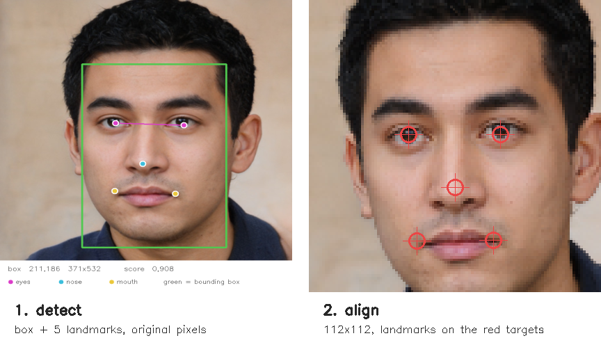
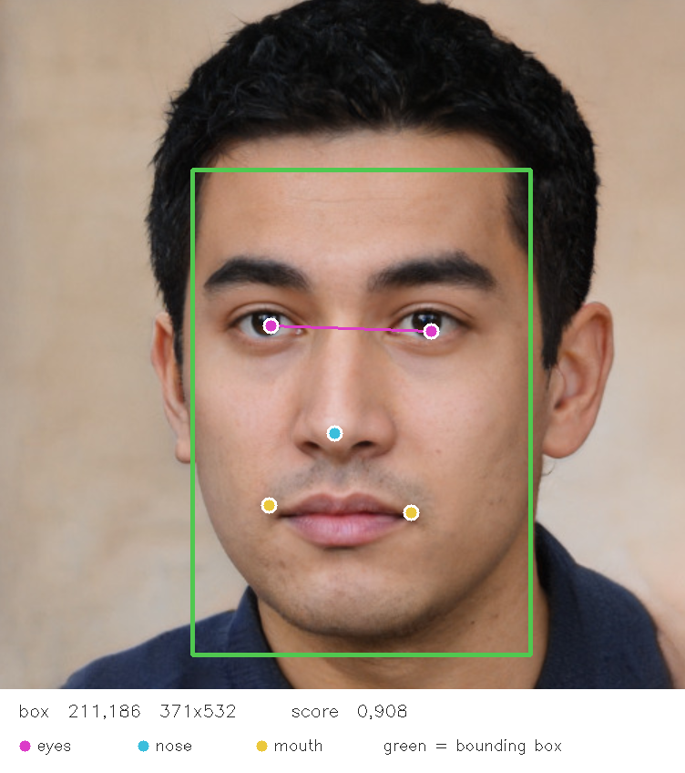
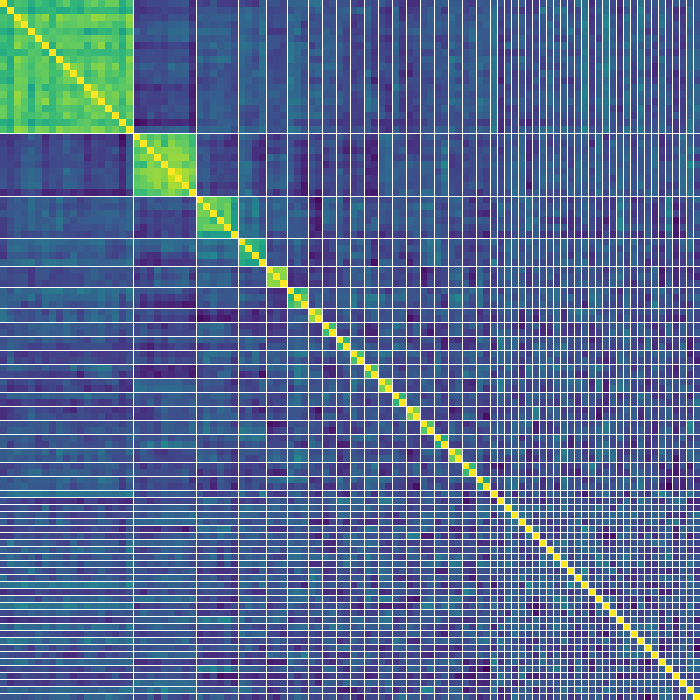

# FaceReco

A command-line face recognition tool for Windows, built on OpenCV's **YuNet**
detector and **SFace** recognizer through [Emgu.CV](https://www.emgu.com/) on .NET 9.

It does three things:

| command | what it does |
|---|---|
| `recognize` | scans a folder and enrols one identity per image into a gallery file |
| `compare` | takes two faces and answers *same person or not* |
| `search` | takes one face and finds it among everything enrolled |

Both models ship with the repository, so there is nothing to download.

---

## How it works

Recognition happens in four stages, and every command runs some part of this pipeline.



**1. Capture.** The image is read in BGR — OpenCV's native channel order, which is
what both models were trained on. Reading it as RGB instead silently lowers every
detection score by roughly 0.01, which is enough to push borderline faces under
the threshold and make them vanish.

**2. Detect.** YuNet returns one row of 15 numbers per face: a bounding box (4),
five landmarks (10), and a confidence score (1). The landmarks are the centre of
each eye, the nose tip, and both mouth corners.



**3. Align.** The five landmarks drive a rotate-and-scale transform onto a canonical
112×112 crop, so the eyes always land in the same place. This is why a tilted head,
a distant face, or an off-centre crop all still work — the geometry is normalised
away before recognition ever sees the face. The red crosshairs above are the fixed
target positions.

**4. Embed.** SFace turns that 112×112 crop into **128 numbers**. Those numbers are
the identity. They are not measurements you can read — no single value means
"nose width" — but two photos of the same person produce two similar lists.
At 4 bytes each, one identity is 512 bytes, and the original photo is never needed
again.

**5. Compare.** Two identities are compared with cosine similarity, which measures
whether the two lists of numbers point in the same direction. It runs from -1 to 1;
at or above the match threshold, the tool calls it the same person.

---

## Build

Requires the [.NET 9 SDK](https://dotnet.microsoft.com/download) on Windows.

```bash
git clone https://github.com/3a7/FaceReco.git
cd FaceReco
dotnet build FaceID.App -c Release
```

The executable lands in `FaceID.App/bin/Release/net9.0/faceid.exe`, with the two
`.onnx` models copied alongside it. You can also run it without building first:

```bash
dotnet run --project FaceID.App -- recognize imgs
```

Every example below uses `faceid`; substitute `dotnet run --project FaceID.App --`
if you prefer.

---

## Usage

### `recognize` — enrol a folder

```bash
faceid recognize imgs
```

Reads every image in the folder, stores one identity per file, and writes them to
`gallery.json`. Verbose by default:

```
    Abdel_Nasser_Assidi_0002.jpg
        image         250x250, 3 channels, Cv8U
        face (1)      score 0,925  box 77,67 90x114  area 10271
        face (2)      score 0,904  box 194,138 45x59  area 2635
        subject       face (1), the most central one
        eye tilt      1,04 deg
        aligned       112x112, 3 channels, Cv8U
        embedded      1x128 numbers, vector length 12,30
```

and a summary at the end:

```
100 images scanned in 4,5s
146 faces detected
100 identities enrolled
0 images with no usable face
29 images with more than one face
weakest subject  Alejandro_Avila_0002.jpg at 0,877
strongest subject Aaron_Sorkin_0001.jpg at 0,947
gallery written to ...\gallery.json
```

Note the gap between **146 faces detected** and **100 identities enrolled**. A file
gets exactly one identity, but photos often contain bystanders. The tool picks the
face nearest the image centre as the subject, which matters more than it sounds:
choosing the *highest-scoring* face instead picks a bystander in several of the
sample images, and silently enrols the wrong person.

Use `-q` for the summary alone, and `--no-save` to report without writing a gallery.

### `compare` — two faces

Arguments may be image paths, or names already in the gallery.

```bash
faceid compare imgs/Abdullah_Gul_0003.jpg imgs/Abdullah_Gul_0004.jpg
```

```
Abdullah_Gul_0003.jpg  (read from disk)
Abdullah_Gul_0004.jpg  (read from disk)
    cosine 0,746 >= 0,371
    ->  SAME PERSON
```

```bash
faceid compare Abdullah_Gul_0003.jpg Adam_Sandler_0003.jpg
```

```
Abdullah_Gul_0003.jpg  (from gallery)
Adam_Sandler_0003.jpg  (from gallery)
    cosine 0,006  < 0,371
    ->  NOT THE SAME PERSON
```

A real file on disk always wins over a gallery entry of the same name, so a fresh
photo is re-read rather than served from cache. Comparing two names that are both
already enrolled never loads the 39 MB recognizer at all, and returns instantly.

### `search` — one face against many

```bash
faceid search Adrien_Brody_0006.jpg
```

```
Looking for Adrien_Brody_0006.jpg  (from gallery)
among 99 enrolled identities

    MATCH      Adrien_Brody_0007.jpg              0,742
    MATCH      Adrien_Brody_0002.jpg              0,703
    MATCH      Adrien_Brody_0004.jpg              0,696
    MATCH      Adrien_Brody_0005.jpg              0,592
    MATCH      Adrien_Brody_0010.jpg              0,473
    - - - - -  threshold 0,371  - - - - -
    rejected   Al_Pacino_0002.jpg                 0,348
    rejected   Alejandro_Toledo_0015.jpg          0,260
    rejected   Adam_Scott_0001.jpg                0,254

5 match(es), clear of the closest rejection by 0,126
```

The sample set holds six Adrien Brody photos; minus the probe itself, all five were
found and nothing else was. The rejected lines are the nearest misses, printed so
you can see how much margin you actually had.

Pass a folder as a second argument to scan it fresh and ignore the gallery:

```bash
faceid search grafik.png imgs
```

Searching for a face that is not enrolled correctly returns nothing:

```
Looking for grafik.png  (read from disk)
among 100 enrolled identities

    no match anywhere
    - - - - -  threshold 0,371  - - - - -
    rejected   Albert_Costa_0006.jpg              0,329

0 match(es)
```

---

## Options

| option | default | meaning |
|---|---|---|
| `--gallery <path>` | `gallery.json` | gallery file to read or write |
| `--no-save` | off | `recognize`: report results without writing the gallery |
| `--detect <float>` | `0.60` | detection confidence floor, 0 to 1 |
| `--match <float>` | `0.371` | same-person cosine cutoff, -1 to 1 |
| `--top <n>` | `3` | `search`: how many near misses to list |
| `-q`, `--quiet` | off | less per-image detail |
| `--detector <path>` | bundled | override the YuNet model file |
| `--recognizer <path>` | bundled | override the SFace model file |
| `-h`, `--help` | | usage text |

Exit codes: **0** success, **1** runtime error, **2** bad usage.

---

## Reading the numbers

There are two independent scores, and they are easy to confuse.

**The detection score** (`--detect`) is YuNet's confidence that a region is a face
at all. It filters *before* you see anything — a face scoring 0.5 against a 0.6
threshold does not appear as a weak result, it simply is not there. On the sample
set, lowering it from 0.6 to 0.1 takes the face count from 146 to 236, nearly all
of the additions being background clutter. Raising it to 1.0 returns nothing, since
no real face scores a perfect 1.

**The match threshold** (`--match`) is the cosine cutoff between two identities.
This is the one that decides same or different.

The matrix below is every pair of the 100 sample images compared against every
other, sorted so each person's photos sit together. Bright means similar.



The bright diagonal is each face against itself, exactly 1.0. The large bright
block is one person photographed 19 times — different days, clothes and angles, and
the block holds. The dark field is everyone else, hovering near zero. Face
recognition is the job of keeping the blocks bright and the field dark.

---

## Choosing a threshold

OpenCV publishes **0.363** as SFace's cosine cutoff, and that is a reasonable
starting point. This tool defaults to **0.371** because of what the sample set
shows: across all 4,950 pairs, the highest-scoring pair of *different* people
reaches **0.370**, and the lowest-scoring pair of the *same* person sits at
**0.418**. The real separation is the gap between those two numbers, and 0.363
falls just below it — producing two false matches that 0.371 avoids.

That gap is narrow, and it was measured on 100 images. Treat any threshold in the
0.37–0.42 range as defensible, and re-measure on your own data before trusting a
specific value. A useful signal is the `clear of the closest rejection by` line
printed after each search: a large margin means the threshold is nowhere near
mattering, a small one means you are close to an error in either direction.

---

## Project layout

```
FaceID.App/
    Program.cs        argument parsing and command dispatch
    FaceEngine.cs     the pipeline: capture, detect, align, embed
    Gallery.cs        enrolled identities, JSON persistence
    models/           YuNet and SFace, copied to the build output
imgs/                 100 sample photographs
docs/                 the figures in this README
```

`FaceEngine` loads both models once and reuses them, because constructing them
costs far more than running them. Argument parsing is hand-rolled, so the tool
carries no dependency beyond Emgu.CV.

---

## Notes and limitations

**Search is linear.** Every probe is compared against every enrolled identity.
That is fine for hundreds or thousands; beyond that the embeddings belong in a
vector index rather than a dictionary. The comparison logic would not change.

**One identity per file.** Images with several faces contribute only their most
central one. For a crowd photo you would want a record per face rather than per file.

**Windows only**, because of the `Emgu.CV.runtime.windows` package. Swapping in the
matching Linux or macOS runtime package should be all that is required.

**The models** are `face_detection_yunet_2026may.onnx` and
`face_recognition_sface_2021dec.onnx` from the
[OpenCV Zoo](https://github.com/opencv/opencv_zoo); see that repository for their
individual licences and citations.

**The sample images** in `imgs/` are a 100-image subset of
[Labeled Faces in the Wild](https://vis-www.cs.umass.edu/lfw/), a public research
dataset of photographs of public figures. They are included so the tool can be
tried immediately: 49 identities, 19 of whom appear more than once. The portrait
used in the figures above is synthetic and depicts no real person.

**This is a learning project.** It has no liveness detection, so a photograph of a
photograph will pass, and it should not be used where a real access-control decision
depends on it.

---

## Licence

MIT — see [LICENSE](LICENSE). The bundled models and sample images are covered by
their own upstream terms, linked above.
